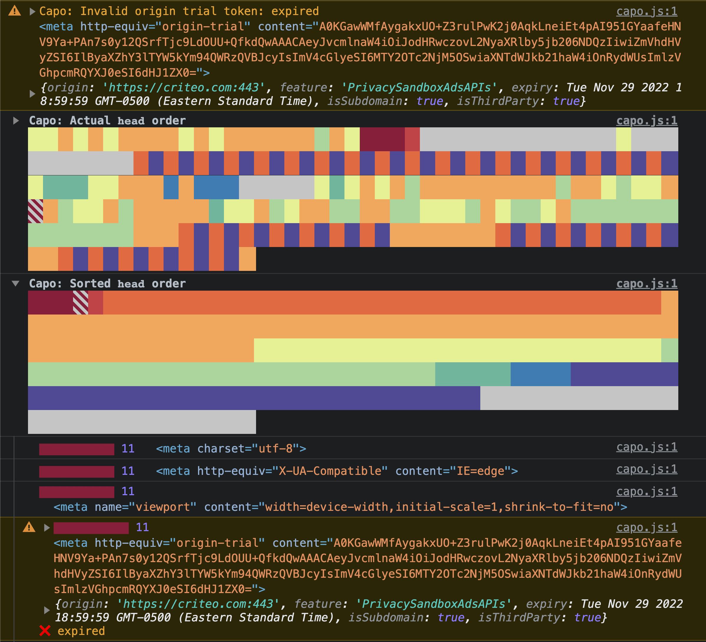
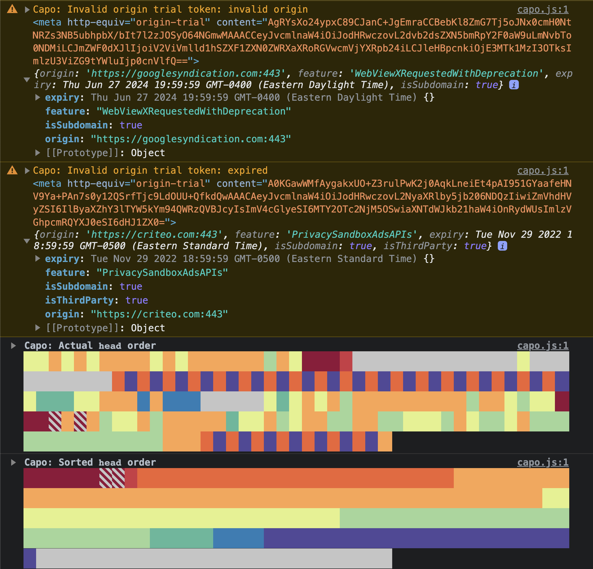

The `<head>` element sets up all of the necessary metadata for a page to load properly and performantly. capo.js performs a number of validation checks on the `<head>` to ensure it meets modern best practices.

:::tip
Validation is enabled by default. To disable it, see the [configuration](/capo.js/user/config/#validation) options.
:::

There are a few ways to see when an element is invalid:

- a warning is logged to the console
- the element appears striped in the color bar
- the expanded console entry is annotated with an ❌ icon

In the example above, you can see all three ways that an element can be flagged as invalid: top-level warning, striped color bar, and warning styles in its expanded entry.

The extension's color bar similarly displays a striped pattern when an element is invalid.

## No disallowed elements

According to the [HTML specification](https://html.spec.whatwg.org/multipage/semantics.html#the-head-element), the only [elements allowed in the `<head>`](https://html.spec.whatwg.org/multipage/dom.html#metadata-content-2) are:

- `<base>`
- `<link>`
- `<meta>`
- `<noscript>`
- `<script>`
- `<style>`
- `<template>`
- `<title>`

If capo.js detects any other elements in the `<head>`, it will log a validation warning.

In the example above, a `<noscript>` element contains an `` child element, so capo.js warns that "IMG elements are not allowed in the `<head>`".

:::danger
When a browser encounters an invalid element, it will immediately close the `<head>` element and open the `<body>` element so that the element can be rendered.

If any valid `<head>` elements come after the invalid element, they will end up in the `<body>`. This is especially problematic for elements that must only appear in the `<head>`, like [SEO metadata](https://twitter.com/JohnMu/status/1670835191852433409).
:::

Of all the invalid elements, `` elements are the [most widespread](https://twitter.com/rick_viscomi/status/1671961075598737409), found on over 1.5 million web pages. This antipattern is commonly used by analytics scripts to fall back to image beacons when users have JavaScript disabled. Unless you routinely test your website with JavaScript disabled, you may be unaware of the potential breakages caused by prematurely closing the `<head>` element.

## Exactly one `<title>` element

The HTML specification requires that there be [exactly one `<title>` element](https://html.spec.whatwg.org/multipage/semantics.html#the-head-element) in the `<head>`, to specify the document title.

If capo.js detects zero or more than one `<title>` element, it will log a validation warning:

In the example above, the `<title>` element is missing, so capo.js warns that "Expected exactly 1 `<title>` element, found 0". 

## No more than one `<base>` element

The HTML specification requires that there be [no more than one `<base>` element](https://html.spec.whatwg.org/multipage/semantics.html#the-head-element) in the `<head>`, to specify the document base URL.

If capo.js detects more than one `<base>` element, it will log a validation warning:

In the example above, there is more than one `<base>` element, so capo.js warns that "Expected at most 1 `<base>` element, found 2".

## No `<meta>` CSP

According to the [W3C specification](https://w3c.github.io/webappsec-csp/#policy-delivery), a Content Security Policy (CSP) can be set as either an HTTP header or a `<meta http-equiv>` tag. 

Despite `<meta>` CSP declarations being technically valid, per the spec, browsers handle them differently. In particular, Chrome will disable the [preload scanner](https://web.dev/preload-scanner/) if it discovers a CSP declared after a `<script>` element. The preload scanner can improve performance by 20%, so this behavior has major implications on the user experience.

:::danger
Due to a [bug in Chrome](https://bugs.chromium.org/p/chromium/issues/detail?id=1458493), a `<meta>` CSP _anywhere_ in the `<head>` will disable the preload scanner.
:::

If capo.js detects a `<meta>` CSP anywhere in the `<head>`, it will log a validation warning:

In the example above, there is a `<meta>` CSP element, so capo.js warns that "CSP meta tags disable the preload scanner due to a bug in Chrome. Use the CSP header instead."

This validation warning is an example of capo.js being more opinionated than simply following the specification. The warning includes a recommendation to use the CSP header instead, which avoids the preload scanner issue all together. Also note that the `Content-Security-Policy-Report-Only` directive is only valid as an HTTP header and not as a `<meta http-equiv>` element.

## No invalid origin trials

Sites can register for [origin trials](https://developer.chrome.com/en/docs/web-platform/origin-trials/) to enable individual experimental web platform features. To enable them on a given site, a token must be included as either an `Origin-Trial` HTTP header or `<meta http-equiv>` element.

These tokens contain encoded metadata about the origin trial registration, including:

- the name of the experimental feature
- the allowed origin
- the expiration date
- whether other subdomains are allowed
- whether other origins are allowed

capo.js decodes these tokens and validates their metadata to ensure that:

- the token is not expired
- the origin is an allowed subdomain
- the origin is an allowed third party

:::caution[Origin trial validation with static evaluation]
Embedded third parties may dynamically inject origin trial `<meta>` elements in order for them to make use of experimental features. By default, capo.js will only evaluate elements in the static `<head>`, so these elements will not be validated. Enable the [dynamic evaluation](/capo.js/user/config/#static-and-dynamic-evaluation) option to validate them.
:::

If capo.js detects an invalid origin trial token, it will log a validation warning:

In the example above, two separate embedded third party scripts injected origin trial `<meta>` elements with invalid tokens, so in each case capo.js warns that there is an "Invalid origin trial token". The warning also includes a reference to the `<meta>` element as well as the decoded token metadata.

In the first warning, the token contains an invalid origin. The token metadata is missing the `isThirdParty` flag and the `origin` property is set `https://googlesyndication.com:443`, which is presumably the third party that injected the token. However, because the origin of the page is different from the one in the origin trial metadata, and it wasn't registered as a third party token, it's not valid. A similar warning would appear if the origin of the page is `https://www.example.com` but the origin in the metadata is `https://example.com:443` and it's missing the `isSubdomain` flag.

In the second warning, the origin is a valid third party, but the token is expired. In the token metadata, you can see that it expired in November 2022.
